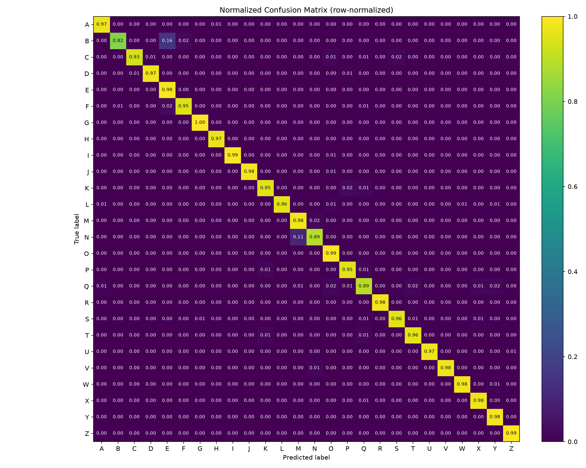
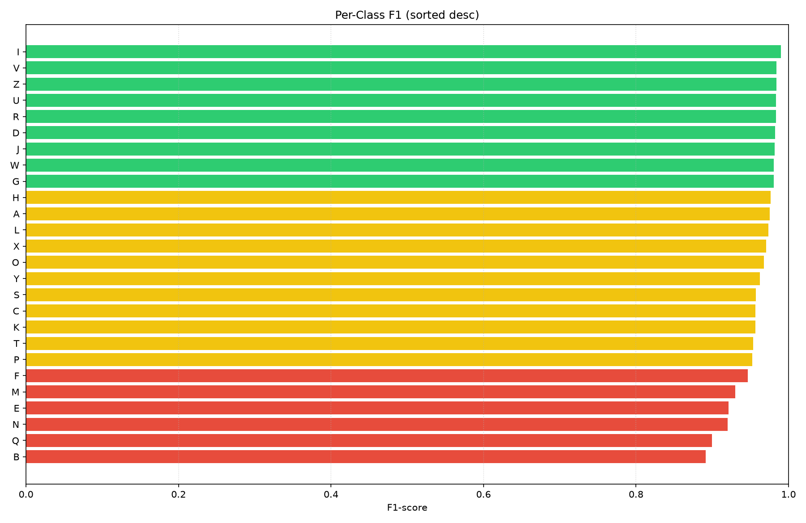
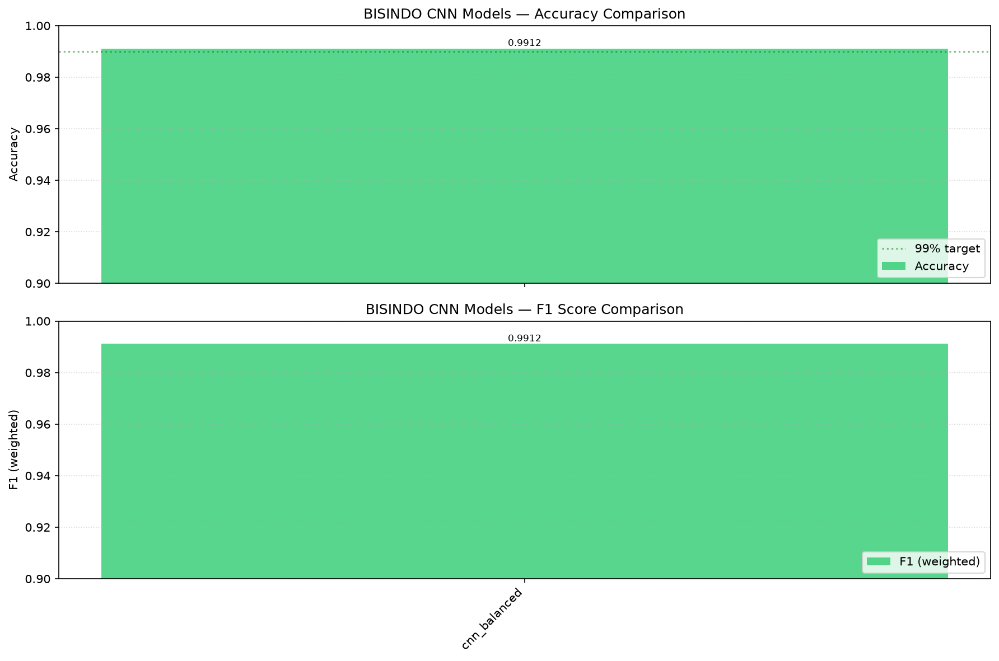

# Laporan Presentasi — BISINDO Bridge

> Progress project dari ide awal sampai produk akhir (meeting real-time).
> Fokus model: **CNN 1D** (Deep Learning).
> Catatan: gambar confusion matrix & chart ada di `models/dl/` (sertakan folder tersebut saat buka file ini).

---

## Slide 1 — Judul & Tim

**Penjelasan:**
Project ini bernama **BISINDO Bridge**, sebuah sistem penerjemah dua arah untuk BISINDO (Bahasa Isyarat Indonesia) yang berbasis pengenalan gesture dari landmark tangan. Project dikerjakan oleh tim beranggotakan 5 orang yang dibagi menjadi fokus Deep Learning (DL), Machine Learning (ML), dan proposal/dokumentasi. Sesuai dengan kurikulum, project ini juga berisi studi perbandingan antara pendekatan klasik (ML) dan deep learning (DL) untuk klasifikasi gesture — namun untuk presentasi ini kita fokuskan ke sisi DL yaitu CNN 1D. Slide judul ini sekadar memperkenalkan nama project, siapa saja anggota tim, dan konteks bahwa ini adalah tugas yang menggabungkan pipeline data, pelatihan model, hingga produk akhir berupa aplikasi meeting.

---

## Slide 2 — Latar Belakang & Masalah

**Penjelasan:**
BISINDO memiliki 26 huruf alfabet, di mana setiap huruf direpresentasikan oleh pose tangan yang berbeda. Masalah utamanya: komunikasi antara penyandang tunarungu dan pendengar sering terkendala karena minimnya alat bantu yang bisa menerjemahkan isyarat secara otomatis dan real-time. Di sisi lain, perkembangan computer vision sudah memungkinkan deteksi titik-titik tangan (landmark) secara langsung dari kamera. MediaPipe, misalnya, bisa mendeteksi 21 landmark per tangan lengkap dengan koordinat x, y, z. Koordinat inilah yang kemudian bisa dijadikan fitur untuk diklasifikasikan menjadi huruf tertentu. Jadi akar masalahnya adalah: ada celah antara kemampuan mendeteksi tangan dan belum adanya sistem yang menyambungkannya menjadi alat komunikasi yang nyata.

---

## Slide 3 — Tujuan & Ruang Lingkup

**Penjelasan:**
Tujuan utama project ini adalah membangun sistem yang bisa mengenali huruf BISINDO dari kamera, lalu menyusun huruf-huruf tersebut menjadi kata dan kalimat yang bisa dibaca orang lain. Ruang lingkupnya meliputi: (1) pengumpulan dataset landmark tangan, (2) pembuatan dan pelatihan model CNN 1D untuk klasifikasi huruf, (3) inference di sisi browser secara real-time, dan (4) produk akhir berupa meeting video di mana peserta bisa mengirimkan prediksi huruf BISINDO secara langsung ke semua peserta. Kita membatasi fokus model pada CNN 1D (bukan model klasik seperti RF/SVM/MLP) agar pembahasan lebih dalam dan konsisten.

---

## Slide 4 — Alur Sistem End-to-End

**Penjelasan:**
Sistem bekerja dalam alur berikut: kamera menangkap video → MediaPipe mengekstrak 21 landmark tangan (menjadi 63 fitur: x, y, z untuk tiap titik) → fitur tersebut dimasukkan ke model CNN 1D → model memprediksi huruf → huruf-huruf dikumpulkan oleh Sentence Builder menjadi kata dan kalimat → kalimat bisa diucapkan lewat TTS (Text-To-Speech) atau disiarkan ke sesi meeting. Poin penting: inference dilakukan di browser menggunakan ONNX Runtime Web, sehingga pemrosesan tetap di device masing-masing pengguna. Ini membuat sistem ringan, menjaga privasi (video tidak dikirim ke server untuk diproses), dan cepat karena tidak perlu round-trip ke server berat.

---

## Slide 5 — Pengumpulan Dataset

**Penjelasan:**
Dataset dibangun dari kumpulan sampel landmark tangan yang kita ambil sendiri. File utamanya adalah `landmarks_captured_v2.csv` dengan **138.471 baris data**, masing-masing berisi 63 fitur (21 landmark × 3 axis x,y,z) dan label huruf A–Z (26 kelas). Pengumpulan dilakukan lewat dua jalur: web capture yang di-deploy ke Vercel sehingga bisa diakses banyak kontributor, serta script lokal untuk pengambilan massal. Karena data mentah sering tidak seimbang antar huruf, kita juga menyiapkan versi turunan seperti `landmarks_augmented`, `landmarks_balanced`, dan `landmarks_clean`. Versi balanced dan clean inilah yang kemudian menaikkan akurasi model secara signifikan (terlihat saat membandingkan model `cnn` vs `cnn_balanced` di slide evaluasi).

---

## Slide 6 — Model: CNN 1D

**Penjelasan:**
Model yang kita pilih adalah **CNN 1D** (Convolutional Neural Network 1 dimensi). Alasannya: sekumpulan 63 fitur landmark merupakan urutan 1D (bukan gambar 2D), dan convolution 1D sangat cocok untuk menangkap pola spasial di sepanjang urutan titik tangan tersebut — misalnya hubungan posisi antara ujung jari dan pergelangan. Kita melatih beberapa varian untuk mencari yang paling baik, menggunakan PyTorch. Semua varian pakai arsitektur CNN 1D yang sama secara garis besar (3 blok convolution + pooling, input 63 fitur xyz), split data 85/15 stratified (`random_state=42`), epochs 50 — kecuali ada catatan. Yang kita ubah-ubah antar varian adalah **dataset**, **arsitektur**, dan **lama training**. Berikut beda tiap varian:

- **`cnn`** (96.04%) — *baseline*. Pakai data mentah `landmarks_captured_v2.csv` (138.471 baris, distribusi per-huruf natural/tdak rata). Ini patokan awal sebelum ada perbaikan data.
- **`cnn_balanced`** (99.12%) ← **champion**. Arsitektur SAMA dengan `cnn`, tapi data training diganti `landmarks_balanced.csv` yang sudah di-rebalance ke ~5000 sampel per huruf. Hanya ini yang berubah → akurasi naik 3%.
- **`cnn_clean`** (98.13%) — arsitektur sama, tapi pakai `landmarks_clean.csv` (177.748 baris yang sudah dibersihkan dari noise/outlier).
- **`cnn_arch1_k3`** (98.82%) — eksperimen **arsitektur**: beda bentuk CNN (arsitektur "arch1", kernel size 3) untuk lihat pengaruh struktur jaringan.
- **`cnn_final`** (98.63%) — hasil tuning akhir (arsitektur terpilih setelah serangkaian eksperimen di atas).
- **`cnn_quick`** (98.53%) — sama seperti final tapi **epochs cuma 30** (bukan 50) → training lebih cepat, akurasi masih tinggi.
- **`cnn_2hand`** (98.45%) — pakai **data 2 tangan**: input 84 fitur (xy dari 2 tangan), sumber `landmarks_2hands.csv`. Uji apakah tambahan tangan kedua membantu.
- **`cnn_test`** (95.59%) — *bukan model serius*: cuma uji coba kecil (11 huruf A–K, 84 fitur, 14 detik training) untuk cek pipeline jalan.

**Kesimpulan dari varian ini:** perbaikan **data** (balanced/clean) memberi dampak paling besar (+3%), sementara ganti arsitektur/epochs hanya naik-turun tipis di kisaran 98–99%. Makanya `cnn_balanced` jadi champion dan dipakai di web app & meeting.

Tiap model disimpan lengkap: bobot `.pt`, scaler (untuk normalisasi), label kelas, dan metrics.

---

## Slide 7 — Evaluasi & Hasil (Data Aktual)

**Penjelasan:**
Evaluasi dilakukan dengan membagi dataset secara stratified 85/15 (random_state=42) sehingga 15% data (sekitar 20.770 sampel) dipakai sebagai test set yang tidak pernah dilihat saat training. Metrik yang dicatat adalah akurasi dan F1-score weighted. Hasilnya sangat tinggi: champion `cnn_balanced` mencapai **99.12% akurasi** yang masuk kategori production-grade (Tier 1). Untuk melihat detail per huruf, kita juga menghitung confusion matrix dan classification report. Secara umum, huruf-huruf dengan bentuk tangan khas (seperti I, V, Z, U, R) diprediksi sangat akurat (~98% F1), sementara huruf yang bentuk tangannya mirip satu sama lain (seperti B, Q, N, M, E) cenderung lebih sering tertukar dan menjadi bagian terlemah. Ini wajar karena CNN memang sulit membedakan pose yang visually berdekatan.

---

## Slide 8 — Confusion Matrix & Per-Class (Data Aktual)

**Penjelasan:**
Confusion matrix di bawah dihasilkan secara **nyata** dengan menjalankan kembali inference pada model `cnn` (96.04%) lewat `eval/compare.py --reeval` — bukan sekadar ilustrasi. Pipeline-nya: load 138.471 baris → split test 15% → jalanin prediksi PyTorch → hitung `sklearn.confusion_matrix` dan `classification_report`. Hasil re-eval akurasi 96.04% cocok dengan metrik training, memvalidasi bahwa model konsisten.

Dari tabel F1 per huruf:
- **Paling akurat:** I (0.99), V (0.98), Z (0.98), U (0.98), R (0.98)
- **Paling lemah:** B (0.89), Q (0.90), N (0.92), M (0.93), E (0.92)

Cara membaca confusion matrix: angka di diagonal utama adalah prediksi benar; angka di luar diagonal adalah kesalahan. **Recall rendah berarti huruf tersebut sering tertukar jadi huruf lain** — misalnya B punya recall hanya **81.5%** (artinya ~18% prediksi B malah jadi huruf lain), dan N recall **88.8%**. Sementara M dan E punya precision rendah (~87%) yang artinya huruf lain sering salah dikira M/E. Penyebabnya konsisten: pose tangan antar huruf tersebut hampir sama sehingga saling "tabrakan" di prediksi.

Catatan jujur: matrix dan per-class chart di bawah diambil dari model `cnn` karena arsitekturnya bisa direkonstruksi dari checkpoint. Champion `cnn_balanced` (99.12%) tercatat sebagai metrics-only (arsitekturnya tidak bisa direkonstruksi dari state_dict), sehingga tidak memiliki matrix per-class sendiri — angkanya tetap tercatat di `models/comparison_report.md`.

---

## Slide 9 — Perbandingan Lintas Varian (Model Comparison)

**Penjelasan:**
Kita membandingkan **8 varian CNN 1D** dalam satu laporan (`models/comparison_report.md`) untuk melihat pengaruh preprocessing data dan arsitektur terhadap akurasi. Berikut peringkatnya berdasarkan akurasi:

| Rank | Model | Akurasi | F1 | Waktu train |
|------|-------|----------|-----|-------------|
| 1 | `cnn_balanced` | **99.12%** | 99.12% | 3704 s |
| 2 | `cnn_arch1_k3` | 98.82% | 98.82% | 1158 s |
| 3 | `cnn_final` | 98.63% | 98.63% | 895 s |
| 4 | `cnn_quick` | 98.53% | 98.53% | 1781 s |
| 5 | `cnn_2hand` | 98.45% | 98.45% | 153 s |
| 6 | `cnn_clean` | 98.13% | 98.13% | 2604 s |
| 7 | `cnn` | 96.04% | 96.03% | 668 s |
| 8 | `cnn_test` | 95.59% | 95.60% | 14 s |

Insight utamanya: penggunaan data **balanced/clean** menaikkan akurasi sekitar **3%** dibanding data mentah (`cnn` 96.04% → `cnn_balanced` 99.12%). Ini membuktikan bahwa ketidakseimbangan jumlah sampel antar huruf berdampak besar pada kualitas model. Berdasarkan perbandingan ini, `cnn_balanced` ditetapkan sebagai champion dan digunakan di web app serta meeting.

---

## Slide 10 — Inference & Web App

**Penjelasan:**
Agar model bisa dipakai tanpa instalasi, kita mengonversi model PyTorch ke format **ONNX** (`scripts/convert_to_onnx.py`) yang bisa dijalankan langsung di browser via ONNX Runtime Web. Web app terdiri dari `capture.html` dan `index.html` yang di-deploy ke Vercel. Saat user membuka webcam, prediksi huruf terjadi real-time di sisi klien: tangkap frame → MediaPipe ekstrak landmark → ONNX prediksi huruf → Sentence Builder menyusun huruf menjadi kata lalu kalimat → TTS (bahasa id-ID) mengucapkannya. Keuntungan arsitektur ini: tidak butuh server komputasi berat, privasi terjaga, dan latency rendah karena semua di device pengguna.

---

## Slide 11 — Produk Akhir: BISINDO Meeting

**Penjelasan:**
Produk akhir yang kita kembangkan adalah **BISINDO Meeting**: sebuah meeting video real-time multi-peserta di mana setiap orang bisa mengirimkan huruf BISINDO hasil prediksi mereka, dan semua peserta melihat prediksi serta kalimat satu sama lain secara langsung (live). Tampilannya meniru Google Meet: ada mode gallery dan speaker view, daftar peserta, chat, fitur raise hand, dan reaction. Ini mengubah project dari sekadar "pengenal huruf" menjadi alat komunikasi kolaboratif antar tim — sesuai visi awal menjembatani komunikasi BISINDO.

---

## Slide 12 — Cara Kerja Meeting (Simpel)

**Penjelasan:**
Secara teknis, meeting ini menggunakan arsitektur **mesh P2P (peer-to-peer)**: tiap laptop peserta terhubung langsung ke laptop peserta lainnya, dan server hanya berfungsi sebagai penyalur sinyal (signaling) agar mereka tahu alamat masing-masing. Beban video tetap ada di tiap laptop, sehingga server tidak perlu kuat. Agar teman yang berada di jaringan sulit (seperti WiFi kampus atau CGNAT) bisa tetap ikut, kita menambahkan **TURN server publik** sebagai jalur cadangan: kalau koneksi langsung gagal, media dilewatkan lewat relay pihak ketiga. Pendekatan ini sengaja dipilih karena server kita berupa VPS kecil (NAT LXC, 2 core) yang tidak bisa membuka port UDP masuk, sehingga memindahkan beban media ke server (misal pakai SFU) tidak memungkinkan.

---

## Slide 13 — Deploy (Simpel)

**Penjelasan:**
Server meeting dijalankan di VPS melalui **systemd** sehingga otomatis nyala kembali bila VPS restart. Akses ke meeting menggunakan **Cloudflare Tunnel** yang memberikan link HTTPS siap pakai — tinggal di-share ke teman tanpa perlu setting DNS atau port forwarding (cocok karena VPS kita berada di balik NAT). Untuk TURN, kita memasang relay publik gratis agar peserta di jaringan berbeda bisa join. Keseluruhan setup signaling-only ini sangat ringan untuk resource VPS yang terbatas, dan sudah kita verifikasi berjalan stabil (health check mengembalikan status ok, halaman app ter-serve, dan endpoint `/api/turn` mengembalikan kredensial TURN).

---

## Slide 14 — Masalah yang Sudah Diatasi

**Penjelasan:**
Pada saat pertama kali meeting dicoba oleh tim, muncul beberapa bug: ada peserta yang hanya melihat 2 orang, ada yang layarnya hitam total, dan ada video yang hilang tiba-tiba. Setelah ditelusuri, penyebabnya tiga:
1. **Tidak ada TURN** — peserta di jaringan tertutup (CGNAT/WiFi kampus) gagal terhubung karena STUN saja tidak cukup.
2. **Tidak ada mekanisme retry** — kalau koneksi putus sejenak, video tidak pernah kembali (hilang permanen).
3. **Race condition saat join** — peserta yang sudah ada di room tidak dihubungi secara proaktif, sehingga sebagian koneksi tidak terbentuk.

Perbaikan yang kita lakukan: memasang TURN publik, menambahkan auto ICE-restart + auto-reconnect saat koneksi drop, dan memperbaiki logika hubung-sambung saat join (peserta baru aktif menghubungi semua yang sudah ada di room). Setelah fix, meeting berjalan stabil untuk seluruh tim.

---

## Slide 15 — Limitasi & Rencana

**Penjelasan:**
Beberapa limitasi dan rencana pengembangan ke depan:
- **Link meeting bisa berganti** tiap restart karena kita memakai quick tunnel (URL acak). Rencana: beralih ke named Cloudflare Tunnel agar URL tetap.
- **TURN masih pakai relay publik** (shared, tidak privat). Rencana: membuat akun TURN sendiri (mis. Metered.ca gratis) agar trafik lebih privat dan stabil.
- **CNN 1D baru mencakup 26 huruf alfabet**. Rencana: menambah pengenalan kata/kalimat utuh dan dukungan dua tangan (2-hand) untuk ekspresi BISINDO yang lebih kaya.
- **Confusion matrix baru ada untuk model `cnn`**, belum untuk champion `cnn_balanced` (butuh retrain ulang dengan arsitektur terkini).

---

## Slide 16 — Kesimpulan & Demo

**Penjelasan:**
Secara keseluruhan, project ini sudah mencakup ujung ke ujung: dari ide awal → pengumpulan dataset → pelatihan CNN 1D → inference di web browser → hingga produk meeting real-time. Dengan akurasi model menembus 99% (champion `cnn_balanced`) dan meeting yang sudah stabil di-deploy, sistem ini sudah bisa dipakai oleh tim untuk berlatih maupun berkomunikasi BISINDO secara langsung. Untuk demo, buka link meeting di dua device dengan jaringan berbeda, lalu coba kirim huruf BISINDO — prediksi dan kalimat akan muncul secara live di semua peserta.
